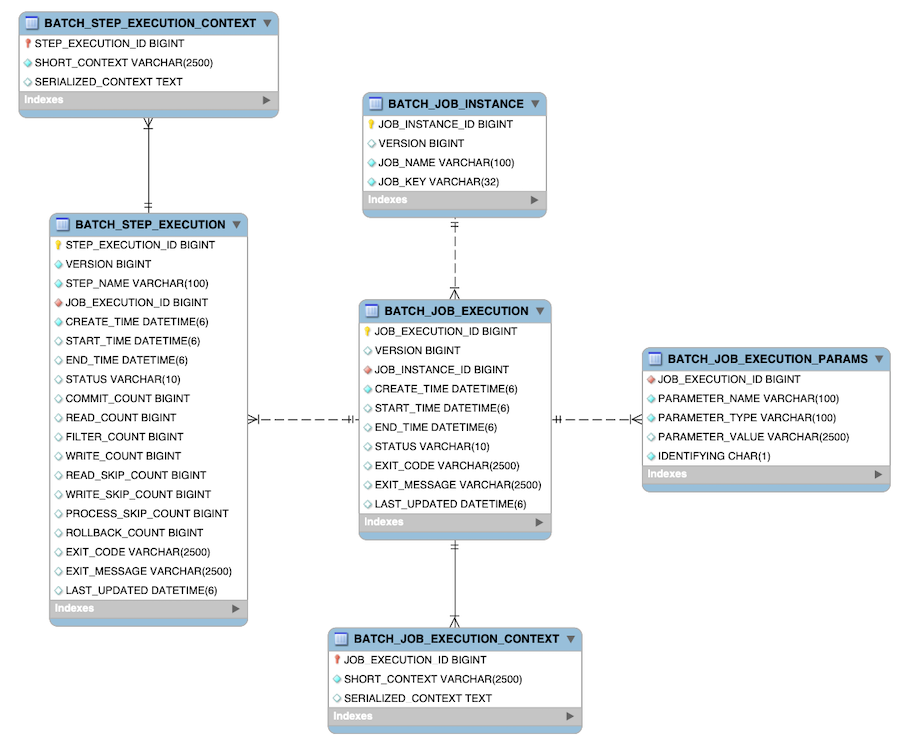

## 📌 Spring Batch란 무엇인가?

- **대용량 데이터**를 처리할 수 있도록 설계된 프레임워크로, DB나 파일에서 데이터를 읽고 가공하여 저장하는 작업을 효율적으로 수행한다.
- 주기적으로 반복되는 작업(ex. 월말 정산)을 효율적으로 처리할 수 있으며, 스케줄러와 연동하여 특정 시간에 자동으로 실행할 수 있다.
- 트랜잭션 관리, 재시도, 스킵, 재시작 등의 기능도 제공한다.
- 다양한 데이터 소스(DB, CSV, XML 등)와 처리 방식(Chunk, Tasklet)을 지원하며, 멀티스레드 처리, 병렬 처리, 파티셔닝 등의 기능을 통해 성능과 확장성을 높일 수 있다.

 

## 📌 Spring Batch 스키마 구조

- Spring Batch는 Job과 Step의 실행 상태를 관리하기 위해 메타데이터 스키마를 사용한다.
- 이 스키마는 배치 작업의 상태 추적, 재시작, 트랜잭션 관리 등을 지원한다.

### [ 테이블 목록 ]

1. **BATCH_JOB_INSTANCE**
2. **BATCH_JOB_EXECUTION**
3. **BATCH_JOB_EXECUTION_PARAMS**
4. **BATCH_JOB_EXECUTION_CONTEXT**
5. **BATCH_STEP_EXECUTION**
6. **BATCH_STEP_EXECUTION_CONTEXT**
7. **BATCH_JOB_EXECUTION_SEQUENCE**

---

### 1. BATCH_JOB_INSTANCE

**Job 인스턴스 정보**를 저장하는 테이블이다.

| 컬럼명               | 설명                      |
|-------------------|-------------------------|
| `JOB_INSTANCE_ID` | Job 인스턴스의 고유 ID (PK)    |
| `JOB_NAME`        | Job의 이름                 |
| `JOB_KEY`         | Job Parameter로 생성된 고유 키 |

---

### 2. BATCH_JOB_EXECUTION

Job의 **실행 정보**를 저장한다.

| 컬럼명                | 설명                              |
|--------------------|---------------------------------|
| `JOB_EXECUTION_ID` | Job 실행의 고유 ID (PK)              |
| `JOB_INSTANCE_ID`  | Job 인스턴스 ID (FK)                |
| `START_TIME`       | Job 실행 시작 시간                    |
| `END_TIME`         | Job 실행 종료 시간                    |
| `STATUS`           | 실행 상태 (`COMPLETED`, `FAILED` 등) |
| `EXIT_CODE`        | 종료 코드                           |
| `EXIT_MESSAGE`     | 종료 메시지                          |
| `LAST_UPDATED`     | 마지막 업데이트 시간                     |

---

### 3. BATCH_JOB_EXECUTION_PARAMS

Job 실행 시 사용된 **파라미터 정보**를 저장한다.

| 컬럼명                | 설명                           |
|--------------------|------------------------------|
| `JOB_EXECUTION_ID` | Job 실행 ID (FK)               |
| `TYPE_CD`          | 파라미터 타입 (`STRING`, `LONG` 등) |
| `KEY_NAME`         | 파라미터 이름                      |
| `STRING_VAL`       | 파라미터 값 (문자열 타입)              |

---

### 4. BATCH_JOB_EXECUTION_CONTEXT

Job 실행의 **컨텍스트 정보**를 저장한다.

| 컬럼명                  | 설명             |
|----------------------|----------------|
| `JOB_EXECUTION_ID`   | Job 실행 ID (FK) |
| `SHORT_CONTEXT`      | 간단한 컨텍스트 정보    |
| `SERIALIZED_CONTEXT` | 직렬화된 컨텍스트 데이터  |

---

### 5. BATCH_STEP_EXECUTION

각 Step의 **실행 정보**를 저장한다.

| 컬럼명                 | 설명                              |
|---------------------|---------------------------------|
| `STEP_EXECUTION_ID` | Step 실행의 고유 ID (PK)             |
| `JOB_EXECUTION_ID`  | Job 실행 ID (FK)                  |
| `STEP_NAME`         | Step의 이름                        |
| `START_TIME`        | Step 실행 시작 시간                   |
| `END_TIME`          | Step 실행 종료 시간                   |
| `STATUS`            | 실행 상태 (`COMPLETED`, `FAILED` 등) |
| `READ_COUNT`        | 읽은 데이터의 개수                      |
| `WRITE_COUNT`       | 쓴 데이터의 개수                       |
| `EXIT_CODE`         | 종료 코드                           |

---

### 6. BATCH_STEP_EXECUTION_CONTEXT

Step 실행의 **컨텍스트 정보**를 저장한다.

| 컬럼명                  | 설명              |
|----------------------|-----------------|
| `STEP_EXECUTION_ID`  | Step 실행 ID (FK) |
| `SHORT_CONTEXT`      | 간단한 컨텍스트 정보     |
| `SERIALIZED_CONTEXT` | 직렬화된 컨텍스트 데이터   |

---

### 7. BATCH_JOB_EXECUTION_SEQUENCE

**시퀀스 테이블**로, Job과 Step 실행 ID를 생성하는 데 사용된다.

| 컬럼명  | 설명    |
|------|-------|
| `ID` | 시퀀스 값 |

 

## 📌 Spring Batch의 시퀀스 테이블 구조

Spring Batch는 **Job**, **Job Execution**, **Step Execution**의 고유 ID 생성을 위해 시퀀스 테이블을 사용한다. 이를 통해 ID의 일관성을 유지하고, 충돌을 방지할 수
있다.

### 1. BATCH_JOB_SEQ

- **Job 인스턴스**의 고유 ID 생성을 담당한다.
- 배치 잡(`BATCH_JOB_INSTANCE`)의 기본키(`JOB_INSTANCE_ID`) 값으로 사용된다.

| 컬럼명          | 타입      | 설명                         |
|--------------|---------|----------------------------|
| `ID`         | BIGINT  | Job 인스턴스의 고유 ID 값          |
| `UNIQUE_KEY` | CHAR(1) | 시퀀스를 구분하는 유니크 키 (기본값: ' ') |

---

### 2. BATCH_JOB_EXECUTION_SEQ

- **Job Execution**의 고유 ID 생성을 담당한다.
- 배치 잡 실행(`BATCH_JOB_EXECUTION`)의 기본키(`JOB_EXECUTION_ID`) 값으로 사용된다.

| 컬럼명          | 타입      | 설명                         |
|--------------|---------|----------------------------|
| `ID`         | BIGINT  | Job Execution의 고유 ID 값     |
| `UNIQUE_KEY` | CHAR(1) | 시퀀스를 구분하는 유니크 키 (기본값: ' ') |

---

### 3. BATCH_STEP_EXECUTION_SEQ

- **Step Execution**의 고유 ID 생성을 담당한다.
- 배치 스텝 실행(`BATCH_STEP_EXECUTION`)의 기본키(`STEP_EXECUTION_ID`) 값으로 사용된다.

| 컬럼명          | 타입      | 설명                         |
|--------------|---------|----------------------------|
| `ID`         | BIGINT  | Step Execution의 고유 ID 값    |
| `UNIQUE_KEY` | CHAR(1) | 시퀀스를 구분하는 유니크 키 (기본값: ' ') |

---

### Spring Batch에서 시퀀스 테이블이 중요한 이유

- **중복 방지**: 동일한 잡 또는 스텝이 여러 번 실행될 때 고유한 식별자를 부여해 중복 문제를 피할 수 있다.
- **재시작 가능성**: 실패한 작업이 재시작될 때 이전의 실행 기록을 추적하고, 정확한 위치에서 이어서 수행할 수 있다.
- **일관성 유지**: 여러 트랜잭션이 동시에 실행될 때도 일관된 ID 값을 부여할 수 있다.

- Spring Batch는 메모리 DB(H2, HSQLDB 등)를 사용할 때 자동으로 시퀀스 테이블을 생성한다. 그러나 외부 DB(MySQL, PostgreSQL 등)를 사용할 때는 수동으로 DDL 스크립트를
  실행해 테이블을 생성해야 할 수도 있다.
