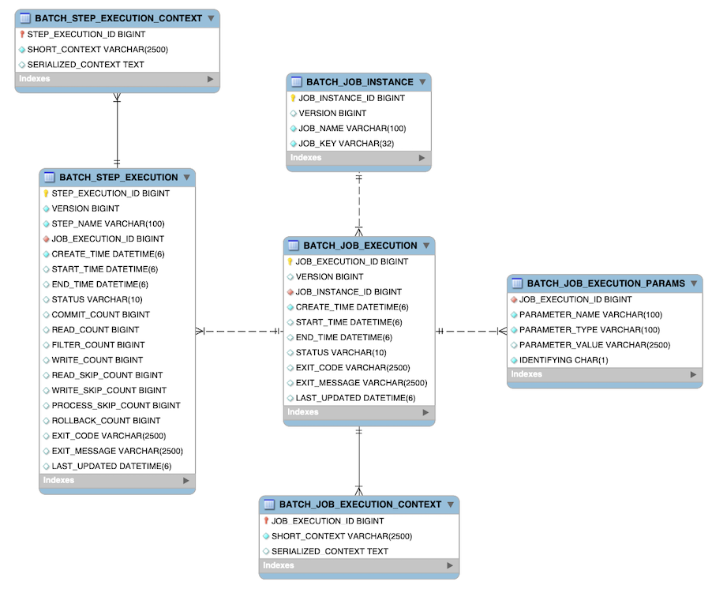

## Spring Batch 시작하기

### Spring Batch란?

Spring Batch는 대용량 데이터 처리를 위한 오픈소스 프레임워크로 대용량 데이터를 처리하는데 필요한 기능을 제공합니다.  
예를 들어 대용량 데이터를 한번에 읽고, 처리하거나 작은 단위로 나누어 처리하는 기능들을 제공합니다.  
Spring Batch는 Job, Step, ItemReader, ItemProcessor, ItemWriter 등의 개념을 제공하는데 이런 부분들은 이후 다음 챕터에서 다루도록 하겠습니다.

### Project 생성

프로젝트를 생성하기 전에 먼저 어떤 언어, 어떤 데이터베이스를 사용할지 정해야 합니다.
저는 Kotlin 언어를 사용하려고합니다.
데이터베이스는 H2, HSQL, Derby 이 3개 중에 하나를 사용하려고 합니다.

이 데이터베이스들의 특징을 살펴 보기 전에 먼저 알고 가야할 키워드들을 정리해보겠습니다.

- 인메모리 데이터베이스 : 메모리에 데이터를 저장하는 데이터베이스로 속도가 빠르지만 application 종료시 데이터가 사라집니다.
- 임베디드 모드(Embedded Mode) : application의 library 형태로 외부에서 접근할 수 없고 application 내부에서만 사용할 수 있습니다.
- 네트워크 모드(Network Server Mode) : application 외부에서 네트워크를 통한 접근이 가능한 모드입니다.

위 데이터베이스들 각각의 특징을 보면

- H2 : 가장 대표적인 인메모리 데이터베이스로 경량 데이터베이스로 빠른 속도를 가지고 있습니다.
- HSQL : Java 기반의 데이터베이스로 트랜잭션, 인메모리, 파일 기반의 데이터베이스, 임베디드 모드, 네트워크 모드를 지원합니다.
- Derby : Java 기반의 데이터베이스로 HSQL과 비슷한 특징을 가지고 있습니다.

위 특징들을 종합해봤을 때 저는 HSQL을 사용하려고 합니다.

### 스프링배치 스키마 구조

스프링배치는 스키마를 제공하는데 이 스키마를 사용하면 스프링배치에서 제공하는 기능들을 사용할 수 있습니다.  
스프링 배치에서 제공해주는 스키마를 자동으로 생성하려면 yml 파일에 스키마를 자동 생성하는 설정을 추가해야 합니다.
그리고 @EnableBatchProcessor를 설정하면 실행될때 배치를 위한 테이블이 자동으로 생성이 된다.

```yml
spring:
  batch:
    jdbc:
      initialize-schema: always
```

#### 스키마 구조

스키마 구조는 다음과 같습니다.


**BATCH_JOB_INSTANCE :**

Job의 실행을 나타내는 가장 최상위 테이블입니다.  
배치가 실행되면 Job이 생성이 되고 해당 잡 인스턴스에 대해서 관련된 모든 정보를 가지고 있습니다.

```hsqldb
CREATE TABLE BATCH_JOB_INSTANCE
(
    JOB_INSTANCE_ID BIGINT PRIMARY KEY,
    VERSION         BIGINT,
    JOB_NAME        VARCHAR(100) NOT NULL,
    JOB_KEY         VARCHAR(32)  NOT NULL
);
```

- Job Instance ID : Job의 실행을 식별하는 ID입니다.
- Version : Job의 버전을 나타냅니다. 버전을 사용하는 이유는 낙관적 락(Optimistic Lock)을 사용하기 위해서입니다.
- Job Name : Job의 이름을 나타내고 인스턴스를 식별하기 위해 사용합니다.
- Job Key : JobParameter를 직렬화한 데이터값이고 JobParameter는 Job의 실행에 필요한 파라미터를 나타내는 값입니다.

**BATCH_JOB_EXECUTION :**

Job Execution과 관련된 모든 정보를 저장하는 테이블입니다.    
여기서 Job Execution은 Job Instance의 실행 기록입니다.    
매번 Job이 실행 될 때 JobExecution이라는 테이블에 새로운 레코드가 생성이 된다.

```hsqldb
CREATE TABLE BATCH_JOB_EXECUTION
(
    JOB_EXECUTION_ID BIGINT PRIMARY KEY,
    VERSION          BIGINT,
    JOB_INSTANCE_ID  BIGINT    NOT NULL,
    CREATE_TIME      TIMESTAMP NOT NULL,
    START_TIME       TIMESTAMP DEFAULT NULL,
    END_TIME         TIMESTAMP DEFAULT NULL,
    STATUS           VARCHAR(10),
    EXIT_CODE        VARCHAR(20),
    EXIT_MESSAGE     VARCHAR(2500),
    LAST_UPDATED     TIMESTAMP,
    constraint JOB_INSTANCE_EXECUTION_FK foreign key (JOB_INSTANCE_ID)
        references BATCH_JOB_INSTANCE (JOB_INSTANCE_ID)
);
```

- JOB_EXECUTION_ID : 배치가 실행될 때의 ID이며 유니크하기 때문에 실행을 구분할 수 있다.
- VERSION : JobExecution의 버전을 나타냅니다.
- JOB_INSTANCE_ID : BATCH_JOB_INSTANCE 테이블의 기본키로 외래키입니다. 이 키를 통해 JobInstance와 JobExecution을 연결합니다.
- CREATE_TIME : JobExecution이 생성된 시간입니다.
- START_TIME : JobExecution이 시작된 시간입니다.
- END_TIME : JobExecution이 끝난 시간입니다.
- STATUS : JobExecution의 상태를 나타냅니다. (COMPLETED, STARTING, STARTED, STOPPING, STOPPED, FAILED, ABANDONED, UNKNOWN)
- EXIT_CODE : JobExecution이 종료된 이유를 문자나 숫자로 나타냅니다.
- EXIT_MESSAGE : JobExecution이 종료된 이유에 대한 메시지를 나타내며 주로 stack trace 형태로 나타납니다.
- LAST_UPDATED : JobExecution의 상태나 기타 메타데이터가 마지막으로 변경된 시각을 나타냅니다.

**BATCH_JOB_EXECUTION_PARAMS :**

JobParameter에 대한 정보를 저장하는 테이블입니다.  
위에서 설명했듯이 JobParameter는 Job의 실행에 필요한 파라미터를 나타내고 하나 이상의 key/value 쌍으로 구성되며 Job이 실행될때 전달된 파라미터를 저장합니다.  
각 파라미터는 IDENTIFYING이 true로 설정되면 JobParameter 생성시 유니크한 값으로 사용된 경우라는 의미입니다.  
신기하게도 이 테이블은 기본키가 존재하지 않습니다.

```hsqldb
CREATE TABLE BATCH_JOB_EXECUTION_PARAMS
(
    JOB_EXECUTION_ID BIGINT       NOT NULL,
    PARAMETER_NAME   VARCHAR(100) NOT NULL,
    PARAMETER_TYPE   VARCHAR(100) NOT NULL,
    PARAMETER_VALUE  VARCHAR(2500),
    IDENTIFYING      CHAR(1)      NOT NULL,
    constraint JOB_EXEC_PARAMS_FK foreign key (JOB_EXECUTION_ID)
        references BATCH_JOB_EXECUTION (JOB_EXECUTION_ID)
);
```

- JOB_EXECUTION_ID: BATCH_JOB_EXECUTION의 외래키이며 JobExecution이 실행될 때 여러 행이 생성될 수 있습니다.(1:N 관계)
- PARAMETER_NAME: 파라미터 이름
- PARAMETER_TYPE: 파라미터의 타입
- PARAMETER_VALUE: 파라미터 값
- IDENTIFYING: 파라미터가 JobInstance의 유니크성을 위해 사용된 파라미터라면 true로 세팅됩니다.

**BATCH_JOB_EXECUTION_CONTEXT :**

Job의 ExecutionContext 에 대한 모든 정보를 저장합니다.  
ExecutionContext는 JobExecution이 실행 되면서 필요한 모든 정보를 저장하는데 JobExecution이 실행될 때 생성되며 JobExecution이 종료될 때 삭제됩니다.  
JobExecution마다 정확히 하나의 JobExecutionContext를 가집니다.  
이 데이터는 일반적으로 실패 후 중단된 부분부터 시작될 수 있도록 실패후 검색 해야 하는 상태를 나타냅니다.

```hsqldb
CREATE TABLE BATCH_JOB_EXECUTION_CONTEXT
(
    JOB_EXECUTION_ID   BIGINT PRIMARY KEY,
    SERIALIZED_CONTEXT CLOB,
    SHORT_CONTEXT      VARCHAR(2500) NOT NULL,
    constraint JOB_EXEC_CTX_FK foreign key (JOB_EXECUTION_ID)
        references BATCH_JOB_EXECUTION (JOB_EXECUTION_ID)
);
```

- JOB_EXECUTION_ID : BATCH_JOB_EXECUTION의 외래키입니다.
- SERIALIZED_CONTEXT : ExecutionContext를 직렬화한 데이터입니다.
- SHORT_CONTEXT : SERIALIZED_CONTEXT를 짧은 문자열로 표현한 ExecutionContext입니다.

**BATCH_STEP_EXECUTION :**

StepExecution과 관련된 모든 정보를 가집니다.  
BATCH_JOB_EXECUTION 테이블과 유사하고 하나의 JobExecution에 여러 StepExecution이 존재할 수 있습니다. (Job과 Step은 1:N 관계)

```hsqldb
CREATE TABLE BATCH_STEP_EXECUTION
(
    STEP_EXECUTION_ID  BIGINT       NOT NULL PRIMARY KEY,
    VERSION            BIGINT       NOT NULL,
    STEP_NAME          VARCHAR(100) NOT NULL,
    JOB_EXECUTION_ID   BIGINT       NOT NULL,
    CREATE_TIME        TIMESTAMP    NOT NULL,
    START_TIME         TIMESTAMP DEFAULT NULL,
    END_TIME           TIMESTAMP DEFAULT NULL,
    STATUS             VARCHAR(10),
    COMMIT_COUNT       BIGINT,
    READ_COUNT         BIGINT,
    FILTER_COUNT       BIGINT,
    WRITE_COUNT        BIGINT,
    READ_SKIP_COUNT    BIGINT,
    WRITE_SKIP_COUNT   BIGINT,
    PROCESS_SKIP_COUNT BIGINT,
    ROLLBACK_COUNT     BIGINT,
    EXIT_CODE          VARCHAR(20),
    EXIT_MESSAGE       VARCHAR(2500),
    LAST_UPDATED       TIMESTAMP,
    constraint JOB_EXECUTION_STEP_FK foreign key (JOB_EXECUTION_ID)
        references BATCH_JOB_EXECUTION (JOB_EXECUTION_ID)
);
```

- STEP_EXECUTION_ID : StepExecution의 ID로 유니크한 값입니다.
- VERSION : StepExecution의 버전을 나타냅니다.
- STEP_NAME : Step의 이름을 나타냅니다.
- JOB_EXECUTION_ID : BATCH_JOB_EXECUTION의 외래키입니다.
- CREATE_TIME : StepExecution이 생성된 시간입니다.
- START_TIME : StepExecution이 시작된 시간입니다.
- END_TIME : StepExecution이 끝난 시간입니다. 만약 이 값이 비어있다면 에러가 발생했거나 실패하기 전 값이 저장되지 않은 것입니다.
- STATUS : StepExecution의 상태를 나타냅니다. (COMPLETED, STARTING, STARTED, STOPPING, STOPPED, FAILED, ABANDONED, UNKNOWN)
- COMMIT_COUNT : StepExecution이 커밋된 횟수입니다.
- READ_COUNT : StepExecution이 읽은 아이템의 수입니다.
- FILTER_COUNT : StepExecution이 필터링한 아이템의 수입니다.
- WRITE_COUNT : StepExecution이 쓰기한 아이템의 수입니다.
- READ_SKIP_COUNT : StepExecution이 읽기를 스킵한 아이템의 수입니다.
- WRITE_SKIP_COUNT : StepExecution이 쓰기를 스킵한 아이템의 수입니다.
- PROCESS_SKIP_COUNT : StepExecution이 실행 동안 처리 중에 오류나 조건에 맞지 않아 스킵된 아이템의 수를 나타냅니다.
- ROLLBACK_COUNT : StepExecution이 롤백된 횟수입니다.
- EXIT_CODE : StepExecution이 종료된 이유를 문자나 숫자로 나타냅니다.
- EXIT_MESSAGE : StepExecution이 종료된 이유에 대한 메시지를 나타내며 주로 stack trace 형태로 나타납니다.
- LAST_UPDATED : StepExecution의 상태나 기타 메타데이터가 마지막으로 변경된 시각을 나타냅니다.

**BATCH_STEP_EXECUTION_CONTEXT :**

Step의 ExecutionContext에 대한 모든 정보를 저장합니다.  
StepExecution 마다 정확히 하나의 ExecutionContext이 존재합니다.
이 데이터는 일반적으로 JobInstance가 중단된 위치에서 시작 할 수 있도록 실패 후 검색해야 하는 상태를 나타냅니다.

```hsqldb
CREATE TABLE BATCH_STEP_EXECUTION_CONTEXT
(
    STEP_EXECUTION_ID  BIGINT PRIMARY KEY,
    SERIALIZED_CONTEXT CLOB,
    SHORT_CONTEXT      VARCHAR(2500) NOT NULL,
    constraint STEP_EXEC_CTX_FK foreign key (STEP_EXECUTION_ID)
        references BATCH_STEP_EXECUTION (STEP_EXECUTION_ID)
);
```

- STEP_EXECUTION_ID : BATCH_STEP_EXECUTION의 외래키입니다.
- SERIALIZED_CONTEXT : Step에서 발생한 ExecutionContext를 직렬화한 데이터입니다.
- SHORT_CONTEXT : SERIALIZED_CONTEXT를 짧은 문자열로 표현한 ExecutionContext입니다.
