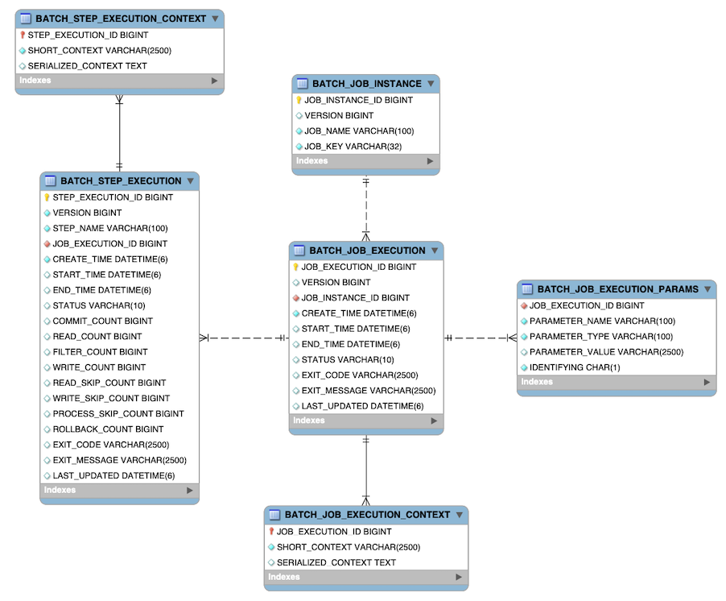

# Spring Batch - 01

## 1. 개요
**배치 처리**란 대량의 데이터에 반복적이고 일관적인 작업을 수행하는 것을 말한다.

**Spring Batch**는 운영 시스템이 필요한 배치 처리를 견고하게 개발을 위해 Spring Framework 기반 배치 프레임워크이다. 

따라서 대용량의 데이터를 처리하는 데 필요한 다양한 기능을 제공한다.
- 로깅/추적
- 트랜잭션 관리
- 작업 처리 통계
- 작업 재시작
- 건너뛰기
- 리소스 관리

>[!WARRING]
> Spring Batch는 스케줄링 프레임워크가 아니다. \
> 우수한 다른 스케줄러(Quartz 등)와 함께 작동하도록 설계되었다.

 

## 2. Spring Batch 스키마 구조
Spring Batch 의존성을 주입하고 어플리케이션을 실행하면 다음과 같은 스키마 구조를 생성한다.

### BATCH_JOB_INSTANCE
스키마의 기본이 되는 인스턴스 테이블
- JOB_INSTANCE_ID: 인스턴스 유니크 아이디
- VERSION: 버젼정보
- JOB_NAME: 잡 이름으로 인스턴스 식별에 사용
- JOB_KEY: JobParameter를 직렬화한 데이터값으로, 다른 잡과 구분하는 값

### BATCH_JOB_EXECUTION
Job이 실행될 때 해당 테이블에 row 적재
- JOB_EXECUTION_ID: 실행 ID. JobExecution 의 getId()로 획득 가능
- VERSION: 버전정보
- JOB_INSTANCE_ID: BATCH_JOB_INSTANCE 테이블의 PK
- CREATE_TIME: execution 생성 시간
- START_TIME: execution 시작 시간
- END_TIME: execution 종료 시간 (성공/실패 모두 남음, 값이 비어있다면 예외로 인한 마지막 저장을 하지 못함)
- STATUS: execution 상태 (BatchStatus 값 사용)
- EXIT_CODE:execution 종료 코드
- EXIT_MESSAGE: 종료 시 남기는 메세지 (가능하면 stacktrace 값이 남음)
- LAST_UPDATED: execution이 마지막으로 지속된 시간

### BATCH_JOB_EXECUTION_PARAMS
JobParameter에 대한 정보를 저장하는 테이블
- JOB_EXECUTION_ID: BATCH_JOB_EXECUTION 의 PK
- PARAMETER_NAME: 파라미터 이름
- PARAMETER_TYPE: 파라미터의 타입
- PARAMETER_VALUE: 파라미터 값
- IDENTIFYING: true로 설정 시 JobInstance의 유니크성을 위해 사용된 파라미터라는 뜻

### BATCH_STEP_EXECUTION
StepExecution에 대한 정보를 저장하는 테이블
- STEP_EXECUTION_ID: execution에 대해 유니크한 아이디 (StepExecution 객체의 getId를 통해 조회가능)
- VERSION
- STEP_NAME: 스텝의 이름
- JOB_EXECUTION_ID: BATCH_JOB_EXECUTION PK. 이는 JobExecution에 StepExecution이 속한다 의미이다. JobExecution에 대해 Step 이름은 유니크해야한다.
- START_TIME: execution 시작 시간
- END_TIME: 종료 시간
- STATUS : 상태(BatchStatus의 값)
- COMMIT_COUNT: 트랜잭션 커밋 수
- READ_COUNT: 읽어들인 아이템 수
- FILTER_COUNT: 필터된 아이템 수
- WRITE_COUNT: 쓰기된 아이템수
- READ_SKIP_COUNT: 읽기가 스킵된 아이템 수
- WRITE_SKIP_COUNT: 쓰기가 스킵된 아이템 수
- PROCESS_SKIP_COUNT: 프로세서가 스킵된 수
- ROLLBACK_COUNT: 롤백된 아이템수
- EXIT_CODE: 종료 문자열
- EXIT_MESSAGE: job 종료 메세지. 가능하다면 stack trace 값이 남음
- LAST_UPDATED: 마지막으로 지속된 시간

### BATCH_JOB_EXECUTION_CONTEXT 
ExecutionContext에 대한 정보 저장\
매 JobExecution마다 하나의 JobExecutionContext를 가짐

- JOB_EXECUTION_ID: BATCH_JOB_EXECUTION 테이블의 PK
- SHORT_CONTEXT: SERIALIZED_CONTEXT 의 문자 버젼
- SERIALIZED_CONTEXT: 직렬화된 전체 컨텍스트

### BATCH_STEP_EXECUTION_CONTEXT
Step의 ExecutionContext 과 관련된 정보 저장\
StepExecution 마다 하나의 ExecutionContext를 가짐

- STEP_EXECUTION_ID: BATCH_STEP_EXECUTION의 PK
- SHORT_CONTEXT: SERIALIZED_CONTEXT 의 문자 버전
- SERIALIZED_CONTEXT: 직렬화된 전체 컨텍스트

 

## SpringBatch Sequence
BATCH_JOB_INSTANCE, BATCH_JOB_EXECUTION, BATCH_STEP_EXECUTION 테이블의 ID 에 고유한 값을 할당하기 위한 시퀀스 테이블이 존재한다.

- BATCH_JOB_SEQ: BATCH_JOB_INSTANCE의 Sequence 테이블 
- BATCH_JOB_EXECUTION_SEQ: BATCH_JOB_EXECUTION의 Sequence 테이블
- BATCH_STEP_EXECUTION_SEQ: BATCH_STEP_EXECUTION의 Sequence 테이블

