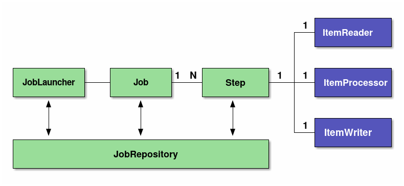
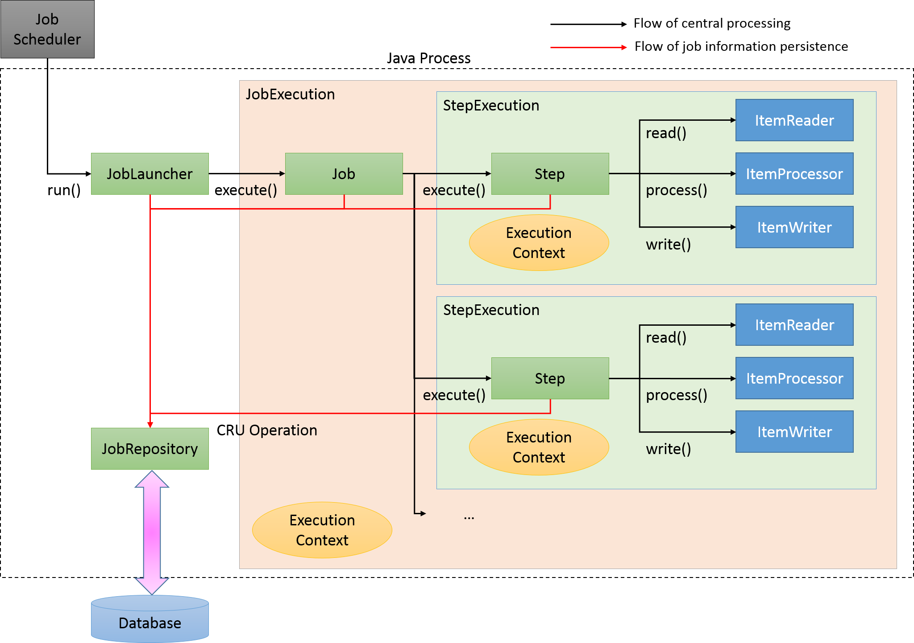

## Spring Batch 모델

### 1. Tasklet 모델

- 단순한 로직을 가진 배치 처리에 적합하다.
- 데이터 소스가 다양하거나 파일 처리 등의 작업에서 유연하게 사용할 수 있다.
- Tasklet 인터페이스를 구현하여 필요한 작업을 정의한다.
- 주로 단일 작업(파일 삭제, DB 업데이트 등)에서 사용한다.

### 2. Chunk 모델

- 대량의 데이터를 처리할 때 유리하다.
- **Reader / Processor / Writer** 흐름으로 데이터 처리가 이루어진다.
- 데이터를 청크 단위(Chunk Size)로 읽고, 처리한 후 일괄 저장할 수 있다.
- 예를 들어, 1000만 건의 데이터를 1000건씩 읽고 처리하여 저장할 수 있다.

 

## Spring Batch 기본 아키텍처

Spring Batch는 다음과 같은 주요 컴포넌트로 구성된다.

| 컴포넌트              | 설명                                                                                                     |
|-------------------|--------------------------------------------------------------------------------------------------------|
| **Job**           | 배치 프로세스의 단위로, 하나 이상의 Step으로 구성된다.                                                                      |
| **Step**          | Job을 구성하는 처리 단위로, Tasklet 또는 Chunk 모델로 작업을 수행할 수 있다. 하나의 Job에 여러 Step을 재사용, 병렬화, 조건분기 등을 수행할 수 있다.     |
| **JobLauncher**   | Job을 실행하는 인터페이스로, 사용자에 의해 직접 수행된다. Java Command를 통해 CommandLineJobRunner를 실행하여 단순하게 배치 프로세스가 수행될 수 있다. |
| **ItemReader**    | 소스 데이터를 읽어 들이는 역할을 수행한다.                                                                               |
| **ItemProcessor** | 읽어들인 청크 데이터를 처리하며, 데이터를 변환하거나 정제하는 역할을 한다. 필요 없는 경우 생략할 수 있다.                                          |
| **ItemWriter**    | 읽어들였거나 처리된 데이터에 대해 쓰기 작업을 담당하며, 데이터베이스 저장, 파일 출력 등을 할 수 있다.                                            |
| **JobRepository** | Job과 Step의 상태 정보를 관리하는 시스템으로, 데이터베이스에 저장하여 재실행을 지원한다.                                                  |

 

## Spring Batch의 처리 흐름

1. **JobScheduler**가 배치를 트리거링하면, **JobLauncher**가 실행된다.
2. **JobLauncher**가 Job을 실행한다. 이때, **JobExecution**을 수행하고, **Execution Context**를 통해 Job의 실행 정보를 전달한다.
3. Job이 실행되면서 정의된 **Step**들을 순차적으로 실행한다. 이때, **StepExecution**을 수행하고, **Execution Context** 정보가 전달되어 수행된다.
4. 각 Step은 **Tasklet** 또는 **Chunk** 모델로 실행된다.
5. **Chunk 모델**의 경우, 다음과 같은 과정이 반복된다.
    - **ItemReader**가 데이터를 읽는다.
    - **ItemProcessor**가 데이터를 처리한다.
    - **ItemWriter**가 데이터를 저장한다.
6. Job의 실행 결과는 **JobRepository**를 통해 저장, 관리된다.

 

## Spring Batch의 저장 정보

Spring Batch는 Job과 Step의 실행 상태 및 결과를 데이터베이스에 저장한다. 이를 통해 중단된 작업을 이어서 실행할 수 있다.

### 1. JobInstance

- Job의 이름과 파라미터를 정의한다.
- Job이 중단되는 경우, 다음 실행 시 중단 이후부터 실행하도록 지원한다.
- 동일한 Job이 재실행되는 경우, 중복 실행되지 않도록 관리한다.

### 2-1. JobExecution

- Job의 물리적 실행을 나타낸다.
- 동일한 **JobInstance**에 대해 여러 번 실행될 수 있다.

### 2-2. ExecutionContext

- 각각의 **JobExecution**에서 처리 단계와 같은 메타 정보들을 공유하는 영역이다.
- 주로 데이터를 공유하거나 프레임워크 상태를 기록하기 위해 사용되며, 애플리케이션에서 **ExecutionContext**에 엑세스하는 수단도 제공된다.
- 저장되는 객체는 **Serializable**이어야 한다.

### 3-1. StepExecution

- Step의 물리적 실행을 나타낸다.
- Job은 여러 Step을 가질 수 있어, **JobExecution**과 **StepExecution**은 **1:N 관계**이다.

### 3-2. ExecutionContext

- Step 내부의 데이터를 공유하는 영역이다.
- 여러 단계에 공유할 필요가 없는 정보는 Job 내의 **ExecutionContext** 대신, Step 내의 **ExecutionContext**를 사용해야 한다.
- 저장되는 객체는 **Serializable**이어야 한다.

### 4. JobRepository

- **JobExecution**, **StepExecution** 등의 실행 정보를 데이터베이스에 저장한다.
- 이를 통해 Spring Batch는 **재실행 기능**이나 **중단 후 재개** 기능을 제공한다.
