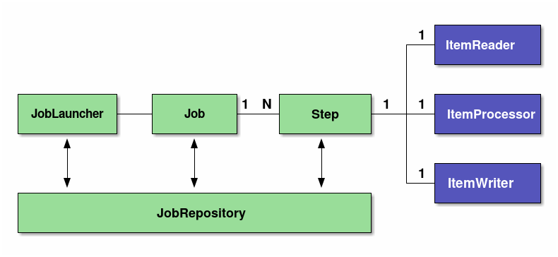
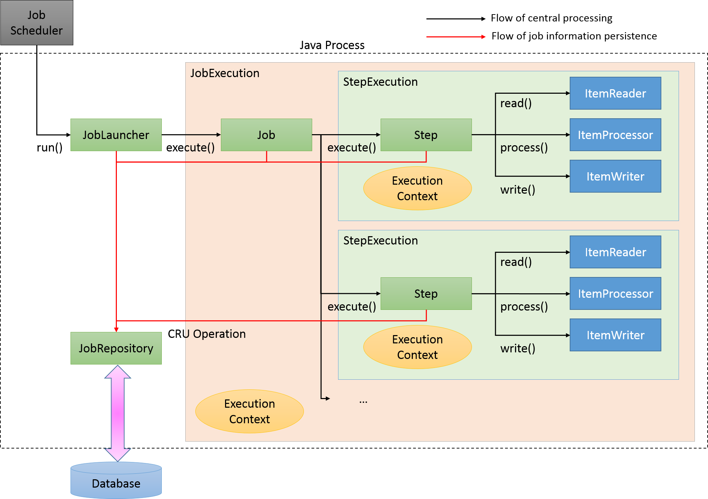

# SpringBatch 코드 설명 및 아키텍처 알아보기

## Basic Spring Batch Structure

### Tasklet

우리는 Tasklet을 구현해서 Job을 구성하겠습니다.  
여기서 Tasklet이란 Spring Batch에서 Job을 실행할 때 필요한 실제 작업을 정의하는 인터페이스입니다.  
그래서 Tasklet의 구현체는 `execute()` 메서드를 구현해야 합니다.  
이 `execute()` 메서드는 `RepeatStatus`를 반환하며, 이 `RepeatStatus`는 `FINISHED` 또는 `CONTINUABLE`을 반환합니다.  
그리고 continueIf 라는 조건에 따라 종료하거나 지속할지 결정할 수 있습니다.

### InitializingBean

`InitializingBean`은 `afterPropertiesSet()` 메서드를 구현해야 합니다.  
`afterPropertiesSet()` 메서드는 이름 그대로 Bean이 생성된 후에 호출되는 메서드입니다.  
이 메서드를 통해 Bean이 생성된 후에 초기화 작업을 수행할 수 있습니다.

### PlatformTransactionManager

PlatformTransactionManager는 Spring Batch에서 트랜잭션을 관리하는 인터페이스입니다.  
Spring batch에서 제공해주는 PlatformTransactionManager의 구현체로는 DataSourceTransactionManager, JpaTransactionManager,
ResourcelessTransactionManager 등이 있습니다.  
각 구현체의 특징은 아래 링크를 참고하시면 됩니다.

출처: https://chung-develop.tistory.com/146#JpaTransactionManager-1

### JobBuilder

JobBuilder는 Job을 생성하는 빌더 클래스입니다.  
JobBuilder에서는 Job의 이름, Job의 실행 정책, Job의 Step을 설정할 수 있습니다.  
JobBuilder는 `incrementer` 옵션을 통해 Job이 실행될때 JobParameter에 Job의 유니크성을 구분할 수 있게 해줍니다.   
우리는 실습에서 `RunIdIncrementer`를 사용할 것이고 이는 Job이 실행될 때마다 run.id를 증가시켜 Job의 유니크성을 보장합니다.

## Spring Batch 아키텍처

### Spring Batch Model

Spring Batch는 DI와 AOP를 지원하는 배치 프레임워크입니다.  
Spring Batch는 Tasklet Model과 Chunk Model을 제공합니다.  
Tasklet model은 단순한 처리 모델이며 간단한 로직을 처리할 때 사용합니다.  
Chunk model은 주로 대용량 데이터를 처리할 때 성능이 뛰어납니다.  
또한 Chunk model은 ItemReader, ItemProcessor, ItemWriter로 구성되어 있습니다.

Spring Batch의 기본 아키텍처는 Job, Step, JobLauncher, ItemReader, ItemProcessor, ItemWriter, Tasklet, JobRepository로 구성되어 있습니다.
여기서 Job은 가장 큰 단위로 Job은 여러 Step으로 구성되어 있습니다.  
Step은 Job의 실행 단위로 Step은 Tasklet 또는 Chunk로 구성되어 있습니다.  
JobLauncher는 Job을 실행하는 인터페이스고 java command로 CommandLineJobRunner를 실행 시켜서 Job을 실행합니다.  
ItemReader는 데이터를 읽어오고 ItemProcessor는 데이터를 가공하고 ItemWriter는 데이터를 저장합니다.  
JobRepository는 Job과 Step의 실행 정보와 같은 메타데이터를 저장하고 관리합니다.

## Spring Batch Flow

### 처리 흐름

Spring Batch의 처리 흐름은 아래와 같습니다.

1. JobScheduler가 JobLauncher를 실행시킨다.
2. JobLauncher는 Job을 실행시키고 JobExecution을 생성한 뒤 ExecutionContext에 Job의 실행 정보를 저장한다.
3. Job은 자신에 속한 Step을 실행하고 StepExecution을 생성한 뒤 ExecutionContext에 Step의 실행 정보를 저장한다.
4. Step은 Tasklet 또는 Chunk 모델로 작업을 수행한다.
5. 우리는 Chunk 모델을 사용해서 ItemReader로 Chunk size만큼 데이터를 읽어오고 ItemProcessor로 데이터를 가공하고 ItemWriter로 데이터를 저장한다.
6. ItemWriter는 Database나 File에 데이터를 저장한다.

### Job 정보의 흐름

1. JobLauncher는 JobRepository를 통해서 JobInstance정보를 Database에 저장합니다.
2. JobExecution을 통해 Job을 실행하고 실행 정보를 Database에 저장합니다.
3. Step은 JobRepository를 통해서 처리 결과값와 상태 정보를 저장합니다.
4. Job이 완료되면 JobRepository를 통해 완료 정보를 저장합니다.

### 스프링배치 저장

#### JobInstance

JobInstance는 Job name과 Job parameter로 구성되어 있습니다.
Job에 문제가 생겨 중단이 되었을 때 JobInstance는 JobParameter로 구분하여 Job을 재시작할 수 있습니다.  
재실행을 지원하지 않거나 Job이 왼료되면 Job을 종료합니다.  

#### JobExecution / ExecutionContext

JobExecution은 잡의 물리적인 실행을 나타냅니다.  
JobInstance는 한번만 실행되지만 JobExecution은 여러번 실행될 수 있습니다.  
그래서 JobInstance와 JobExecution은 1:N 관계입니다.  

JobExecution의 ExecutionContext는 Job의 실행 정보와 같은 메타 데이터를 저장합니다.
ExecutionContext에는 JSON 형태로 데이터를 저장되기 때문에 Serializable을 구현한 객체만 저장할 수 있습니다.

#### StepExecution / ExecutionContext

StepExecution은 Step을 물리적인 실행을 나타냅니다.
Job은 여러 Step을 수행하므로 1:N 관계가 됩니다.

StepExecution의 ExecutionContext는 Step의 실행 정보와 같은 메타 데이터를 저장합니다.  
ExecutionContext에는 JSON 형태로 데이터를 저장되기 때문에 Serializable을 구현한 객체만 저장할 수 있습니다.  

#### JobRepository

JobRepository는 JobExecution과 StepExecution등과 같이 배치 실행 정보나 상태, 결과 값들이 Database에 저장, 조회, 수정, 삭제합니다.  
결국 Spring Batch는 ExecutionContext를 사용하려면 Database가 필요하게 됩니다.  
이렇게 저장된 정보를 활용하여 Spring Batch는 Job을 정지된 상태 이 후부터 재실행 할 수 있습니다.  