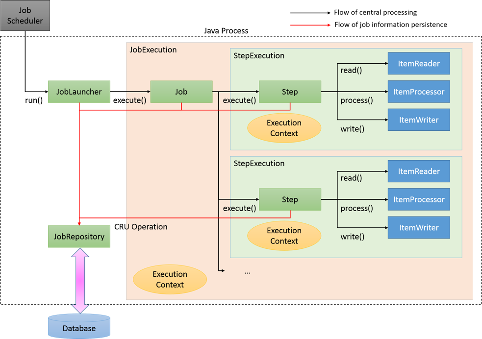

# Spring Batch 02

## Basic Application 실행해보기

### 1. Tasklet 구현체 생성
GreetingTasklet.kt 파일을 생성 후 다음과 같이 작성

```kotlin

class GreetingTasklet : Tasklet, InitializingBean{
    private val logger = KotlinLogging.logger {}

    override fun execute(contribution: StepContribution, chunkContext: ChunkContext): RepeatStatus? {
        logger.info { "------------ Task Execute ------------" }
        logger.info { "GreetingTask: ${contribution}, ${chunkContext}"}

        return RepeatStatus.FINISHED
    }

    override fun afterPropertiesSet() {
        logger.info { "------------ After PropertiesSet ------------" }
    }

}
```

#### Tasklet
execute 함수 구현 필요

- execute
  - StepContribution, ChunkContext 를 파라메터로 받음
  - 최종적으로 RepeatStatus 를 반환한다
  - RepeatStatus
    - FINISHED: Tasklet 종료를 나타님
    - CONTINUABLE: 계속해서 태스크를 수행하도록 함
    - continueIf(condition): 조건에 따라 종료할지 지속할지 결정

#### InitializingBean
afterPropertiesSet 함수 구현 필요

- afterPropertiesSet
    - 태스크를 수행할 때 프로퍼티를 설정하고 난 뒤 수행되는 함수
    - 사실상 없어도 무방함

<br />

### 2. @Configuration 을 통해 생성할 배치 빈 등록
BasicTaskJobConfiguration.kt 파일을 생성한 후 다음과 같이 작성

```kotlin
@Configuration
class BasicTaskJobConfiguration {
    
}
```
SpringBoot 는 Bean 등록 설정을 할 수 있도록 @Configuration 어노테이션을 제공한다.

해당 Config 파일 내부에서 배치 관련 Bean 을 등록해보자.

<br />

### 3. Job, Step
이제 Job, Step 을 생성하고 빈으로 등록해보자 !
BasicTaskJobConfiguration 파일 내부에 다음과 같이 작성한다.

```kotlin
@Configuration
class BasicTaskJobConfiguration {
  val logger = KotlinLogging.logger {}

  @Bean
  fun greetingTasklet(): Tasklet {
    return GreetingTasklet()
  }

  @Bean
  fun step(
    jobRepository: JobRepository,
    transactionManager: PlatformTransactionManager
  ): Step {
    logger.info { "------------- Init myStep -------------" }

    return StepBuilder("myStep", jobRepository)
      .tasklet(greetingTasklet(), transactionManager)
      .build()
  }

  @Bean
  fun myJob(step: Step, jobRepository: JobRepository): Job {
    logger.info { "------------- Init myJob -------------" }

    return JobBuilder("myJob", jobRepository)
      .incrementer(RunIdIncrementer())
      .start(step)
      .build()
  }
}
```
#### 3-1. GreetingTasklet Bean 등록
[[1]](#1-tasklet-구현체-생성) 에서 생성한 GreetingTasklet 도 함께 bean 등록

#### 3-2. Step Bean 등록
- JobRepository 와 PlatformTransactionManager 를 파라미터로 받는다.
  (스프링 배치는 데이터 소스와 함께 작업하므로 필요함)
- StepBuilder 를 통해 Step을 생성하고, step 이름은 "myStep으로 지정"
- tasklet을 스탭에 추가하고, greetingTasklet() 을 통해 스탭 내부에 태스크릿을 주입

#### 3-3. Job Bean 등록
- Job 또한 Builder 패턴을 통해 생성하고, 이름은 "myJob" 으로 지정
- Job은 JopRepository 에 등록된다
- incrementer는 job 이 지속적으로 실행될 때, Job의 유니크성을 구분할 수 있는 방법이다
- RunIdIncrementer는 Job의 ID를 실행할 때 지속적으로 증가시키면서 유니크한 잡을 실행한다
- start(step) 을 통해 잡의 시작 포인트를 잡는다. 처음 시작하는 스텝은 [[3-2]](#3-2-step-bean-등록) 에서 등록한 step 으로 등록한 것

<br />

### 4. 실행하기
```
2024-11-19T00:06:54.535+09:00  INFO 82591 --- [hyeri-batch] [           main] w.s.c.ServletWebServerApplicationContext : Root WebApplicationContext: initialization completed in 713 ms
2024-11-19T00:06:54.562+09:00  INFO 82591 --- [hyeri-batch] [           main] com.hyeri.hyeribatch.GreetingTasklet     : ------------ After PropertiesSet ------------
2024-11-19T00:06:54.575+09:00  INFO 82591 --- [hyeri-batch] [           main] com.zaxxer.hikari.HikariDataSource       : HikariPool-1 - Starting...
2024-11-19T00:06:54.705+09:00  INFO 82591 --- [hyeri-batch] [           main] com.zaxxer.hikari.pool.HikariPool        : HikariPool-1 - Added connection conn0: url=jdbc:h2:tcp://localhost:1521/testdb user=SA
2024-11-19T00:06:54.705+09:00  INFO 82591 --- [hyeri-batch] [           main] com.zaxxer.hikari.HikariDataSource       : HikariPool-1 - Start completed.
2024-11-19T00:06:54.765+09:00  INFO 82591 --- [hyeri-batch] [           main] c.h.h.BasicTaskJobConfiguration          : ------------- Init myStep -------------
2024-11-19T00:06:54.778+09:00  INFO 82591 --- [hyeri-batch] [           main] c.h.h.BasicTaskJobConfiguration          : ------------- Init myJob -------------
2024-11-19T00:06:54.970+09:00  INFO 82591 --- [hyeri-batch] [           main] o.s.b.w.embedded.tomcat.TomcatWebServer  : Tomcat started on port 8080 (http) with context path '/'
2024-11-19T00:06:54.976+09:00  INFO 82591 --- [hyeri-batch] [           main] c.h.hyeribatch.HyeriBatchApplicationKt   : Started HyeriBatchApplicationKt in 1.426 seconds (process running for 2.051)
2024-11-19T00:06:54.977+09:00  INFO 82591 --- [hyeri-batch] [           main] o.s.b.a.b.JobLauncherApplicationRunner   : Running default command line with: []
2024-11-19T00:06:55.132+09:00  INFO 82591 --- [hyeri-batch] [           main] o.s.b.c.l.support.SimpleJobLauncher      : Job: [SimpleJob: [name=myJob]] launched with the following parameters: [{'run.id':'{value=1, type=class java.lang.Long, identifying=true}'}]
2024-11-19T00:06:55.185+09:00  INFO 82591 --- [hyeri-batch] [           main] o.s.batch.core.job.SimpleStepHandler     : Executing step: [myStep]
2024-11-19T00:06:55.202+09:00  INFO 82591 --- [hyeri-batch] [           main] com.hyeri.hyeribatch.GreetingTasklet     : ------------ Task Execute ------------
2024-11-19T00:06:55.205+09:00  INFO 82591 --- [hyeri-batch] [           main] com.hyeri.hyeribatch.GreetingTasklet     : GreetingTask: [StepContribution: read=0, written=0, filtered=0, readSkips=0, writeSkips=0, processSkips=0, exitStatus=EXECUTING], ChunkContext: attributes=[], complete=false, stepContext=SynchronizedAttributeAccessor: [], stepExecutionContext={batch.version=5.1.2, batch.taskletType=com.hyeri.hyeribatch.GreetingTasklet, batch.stepType=org.springframework.batch.core.step.tasklet.TaskletStep}, jobExecutionContext={batch.version=5.1.2}, jobParameters={run.id=1}
2024-11-19T00:06:55.217+09:00  INFO 82591 --- [hyeri-batch] [           main] o.s.batch.core.step.AbstractStep         : Step: [myStep] executed in 31ms
2024-11-19T00:06:55.239+09:00  INFO 82591 --- [hyeri-batch] [           main] o.s.b.c.l.support.SimpleJobLauncher      : Job: [SimpleJob: [name=myJob]] completed with the following parameters: [{'run.id':'{value=1, type=class java.lang.Long, identifying=true}'}] and the following status: [COMPLETED] in 90ms

```
GreetingTask > myStep > myJob 순서로 초기화 되었고
Job > Step > Task 순으로 실행되었음을 알 수 있다.

> [!NOTE]
> 
> #### Tasklet
> execute 단일 함수를 제공하고, Step 내에 구성되어 단일 task를 실행하기 위해 사용된다.
> 
> 위와 같이 구현클래스를 만들어서 실행해도 되고, 익명 클래스나 기본 구현체를 사용하는 방법을 통해 실행할 수 있다.
> 
> Chunk 와 가장 다른 점은 데이터 처리 과정이 내부에서 한 번에 이뤄진다는 점이다.
> 
> Chunk 모델의 경우 데이터 처리는 지정한 size 단위로 페이징처럼 처리된다.

<br /><br />

## Spring Batch 아키텍처

### 스프링 배치 모델
- 스프링 배치는 DI, AOP 를 지원하는 배치 프레임워크이다
- 스프링 배치는 2가지 모델을 가진다.
  - Tasklet model
    - 단순한 처리 모델. 로직 자체가 단순한 경우 사용
    - 다양한 데이터소스나 파일을 한 번에 처리해야 하는 경우 유연
  - Chunk model
    - 데이터 처리량이 매우 큰 경우 효과적으로 처리 가능
    - Reader/Processor/Writer 플로우 방식으로 처리됨

<br />

### 스프링 배치 기본 아키텍처


#### Job
일련의 프로세스를 요약하는 단일 실행 단위

#### Step
Job 을 구성하는 처리 단위
하나의 Job에 여러 Step 포함
하나의 Job에서 여러 Step을 재사용, 병렬화, 조건분기 등 수행 가능
Step은 tasklet / chunk 모델의 구현체가 탑재되어 실행됨

#### JobLauncher
Job을 수행하기 위한 인터페이스
JobLauncher는 사용자에 의해 직접 수행됨
java 커멘드를 통해 CommandLineJobRunner 를 실행해 단순하게 배치 프로세스가 실행될 수 있음

#### ItemReader
chunk 단위 모델에서 사용, 소스 데이터를 읽어들이는 역할 수행

#### ItemProcessor
읽어들인 chunk 데이터를 실제 처리
데이터 변환, 정제 등의 역할 담당
필요 없으면 사용하지 않아도 된다.

#### ItemWriter
처리된 chunk 데이터를 쓰게 작업 수행
데이터베이스로 저장/수정 역할 수행 가능하며, 파일로 작업 결과를 출력할 수 있다.

#### Tasklet
단순하고 유연하게 배치처리를 수행하는 태스크를 수행

#### JobRepository
Job과 Step의 상태를 관리하는 시스템이다
스프링 배치에서 사용하는 테이블 스키마를 기반으로 상태정보를 저장하고 관리

<br />

### Spring Batch 흐름 (chunk 모델 기준)


#### 처리 흐름 관점
1. JobScheduler 가 배치를 트리거하면 JobLauncher를 실행
2. JobLauncher 가 Job 실행. 이 때, JobExecution 을 수행하며, Execution Context 정보 사용
3. Job은 자신에게 정의된 Step 을 실행. 이때, StepExecution 을 수행하고, ExecutionContext 정보가 전달되어 수행됨
4. 위 이미지에서는 Step 이 Chunk 모델로 수행되고 있음
5. Chunk 모델은 ItemReader 를 통해 소스 데이터를 읽음
6. ItemProcessor를 통해 Chunk 데이터 처리 (데이터 변환 or 가공)
7. ItemWriter는 처리된 chunk 데이터 쓰기 작업 수행. DB 에 저장하거나, 파일로 쓰는 역할을 수행한다.

#### Job 정보의 흐름 관점
1. JobLauncher 는 JobRepository 를 통해 JobInstance 정보를 DB에 등록한다
2. JobLauncher 는 JobRepository를 통해 Job 을 수행하고 DB에 시작 정보를 저장한다.
3. JobStep은 JobRepository를 통해 I/O 레코드와 상태 정보 등을 저장한다.
4. Job이 완료되면 JobRepository를 통해 DB에 완료 정보를 저장한다.

<br />

### Spring Batch 저장 정보

#### JobInstance
- Job 이름과 Job 전달 파라미터 정의
- Job이 재실행을 지원하는데 실행 중간에 중단되는 경우, 다음 실행할 때 중단 이후부터 실행하도록 지원
- Job이 재실행을 지원하지 않는 경우, 혹은 성공적으로 처리된 경우 배치를 재실행한다면 중복수행되지 않도록 종료

#### JobExecution / ExecutionContext
- JobExecution
  - Job의 물리적인 실행을 나타낸다
  - JobInstance와 달리 동일한 Job이 여러번 실행될 수 있다 (1 : N)
- ExecutionContext
  - 각각의 JobExecution 에서 처리단계와 같은 메타 정보를 공유하는 영역
  - ExecutionCotext는 주로 스프링배치가 프레임워크 상태를 기록하는데 사용, 애플리케이션에서 ExecutionContext에 엑세스 하는 수단도 제공
  - ExecutionContext에 저장되는 객체는 java.io.Serialized 를 구현하는 클래스여야 함 (전체 직렬화해서 테이블에 저장되므로)

#### StepExecution/ExecutionContext
- StepExecution
  - 여러 Step의 물리적인 실행
  - Job 은 여러 Step 을 실행 (1 : N)
- ExecutionContext
  - Step 내부에서 데이터를 공유하는 영역
  - 데이터의 지역화 관점에서, 여러 단계에 공유할 필요가 없는 정보를 저장하는 데 사용
  - StepExecutionContext도 java.io.Serialized 를 구현해야 한다.

#### JobRepository
- JobExecution과 StepExecution 등과 같은 배치 실행 정보, 상태, 결과 정보들을 DB에 저장하는 역할
- 이렇게 저장된 정보를 활용해 배치 잡의 재실행하거나 정지 후 수행할 수 있는 수단을 제공함