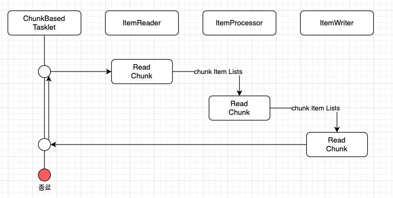

# ChunkModel과 TaskletModel

## Chunk Model

- 데이터를 **일정한 단위(청크)**로 나누어 처리하는 방식입니다.
- `ChunkOrientedTasklet`은 청크 처리를 지원하는 Tasklet의 **구체적인 클래스** 역할을 합니다.
- 청크에 포함되는 데이터의 최대 레코드 수(청크 크기)는 **`commit-interval`**이라는 설정값을 통해 조정할 수 있습니다.
- **`ItemReader`**, **`ItemProcessor`**, **`ItemWriter`**는 청크 단위로 데이터를 처리하기 위한 주요 인터페이스입니다.

### commit-interval

`commit-interval`은 **청크(Chunk) 크기를 설정**하는 속성으로, **한 번의 트랜잭션에서 처리할 레코드의 최대 개수**를 결정합니다.

- Spring Batch에서 청크 기반 처리를 할 때, `commit-interval`에 따라 **데이터를 읽고, 처리하고, 저장하는 작업**이 수행됩니다.
- 예를 들어, `commit-interval=10`으로 설정하면, 10개의 레코드를 읽고 처리한 후 트랜잭션을 커밋(commit)합니다.
- 중간에 실패할 경우, 이미 커밋된 데이터는 유지되며, 이후 실패한 청크부터 재시작할 수 있습니다.

### ChunkOrientedTasklet의 동작 구조

`ChunkOrientedTasklet`은 `ItemReader`, `ItemProcessor`, `ItemWriter` 구현체를 호출하여 데이터를 청크 단위로 처리합니다.



- 청크 단위로 아래의 작업을 반복 실행합니다.
    1. **ItemReader**가 청크 크기만큼 데이터를 읽어옵니다.
    2. 읽어온 데이터를 **ItemProcessor**로 전달하여 처리합니다.
    3. 처리된 데이터는 다시 **ItemWriter**로 전달되어 저장 또는 파일 처리 등의 작업을 수행합니다.

## ItemProcessor

`ItemProcessor` 는 구체적인 구현체를 구현하여 Spring Batch에 전달합니다.

`ItemProcessor`는 `ItemReader`로 읽어온 청크 데이터를 처리하는 역할을 합니다. 여기서 처리란 데이터 변환, 수정, 외부 API 호출 등의 작업을 포함합니다.

`ItemProcessor`는 청크 모델에서 없어도 되는 선택적으로 사용할 수 있는 구성 요소입니다.

- 데이터를 변환하거나 비즈니스 로직을 적용할 필요가 있을 때만 사용되기 때문에 데이터 처리가 필요하지 않을 때에는 필요가 없기 때문입니다.

```java
public class MyItemProcessor implements
      ItemProcessor<MyInputObject, MyOutputObject> {  // (1)
  @Override
    public MyOutputObject process(MyInputObject item) throws Exception {  // (2)

        MyOutputObject processedObject = new MyOutputObject();  // (3)

        // 비즈니스 로직 구현

        return processedObject; // (4)
  }
}
```

- **(1)**: `ItemProcessor` 인터페이스를 구현하며, 입력과 출력 데이터 타입을 제네릭 타입으로 설정합니다.
- **(2)**: `process` 메서드를 오버라이드하여 구현하고, 입력 데이터를 매개변수로 받습니다.
- **(3)**: 처리된 결과를 담은 출력 객체를 생성합니다. 예를 들어 변환된 데이터가 여기에 해당됩니다.
- **(4)**: 처리 결과를 반환합니다.

---

### ItemReader

`ItemReader`는 직접 구현할 수 있지만, Spring Batch에서는 여러 가지 이미 구현된 `ItemReader`를 제공합니다.

### 제공되는 주요 구현체

- **FlatFileItemReader**
    
    플랫 파일(CSV 등)을 읽어 객체로 매핑합니다. 구분자를 기준으로 데이터를 매핑하거나 `Resource` 객체를 사용해 커스텀 매핑도 가능합니다.
    
- **StaxEventItemReader**
    
    XML 파일을 읽어들입니다. StAX 기반으로 작동하며, XML 데이터를 처리하는 데 적합합니다.
    
- **JdbcPagingItemReader / JdbcCursorItemReader**
    
    JDBC를 사용해 SQL 쿼리를 실행하고 데이터베이스 레코드를 읽습니다.
    
    - `JdbcPagingItemReader`: 데이터를 페이지 단위로 처리하며 `JdbcTemplate`을 사용합니다.
    - `JdbcCursorItemReader`: 하나의 SQL로 커서를 사용해 데이터를 처리합니다.
- **MyBatisCursorItemReader / MyBatisPagingItemReader**
    
    MyBatis를 활용해 데이터베이스의 데이터를 읽습니다. `JdbcXXXItemReader`와 동일한 방식으로 작동하나 구현체만 MyBatis를 사용합니다.
    
- **JmsItemReader / AmqpItemReader**
    
    JMS 또는 AMQP에서 메시지를 읽어옵니다.
    

---

### ItemProcessor (구현체)

Spring Batch는 `ItemProcessor`를 위한 다양한 구현체를 제공합니다.

### 제공되는 주요 구현체

- **PassThroughItemProcessor**
    
    입력 데이터를 그대로 반환하며, 추가 처리 없이 데이터를 전달할 때 사용됩니다.
    
- **ValidatingItemProcessor**
    
    데이터를 검증합니다. 검증 규칙을 구현하려면 `Validator` 인터페이스를 구현하거나, `SpringValidatorAdapter`를 활용할 수 있습니다.
    
- **CompositeItemProcessor**
    
    여러 `ItemProcessor`를 순차적으로 실행합니다. 예를 들어, `ValidatingItemProcessor`로 데이터 검증 후 비즈니스 로직을 처리하는 방식으로 사용할 수 있습니다.
    

---

### ItemWriter

`ItemWriter`도 다양한 구현체를 제공합니다.

### 제공되는 주요 구현체

- **FlatFileItemWriter**
    
    처리된 객체를 CSV 파일과 같은 플랫 파일로 작성합니다. 매핑 규칙은 구분자를 기준으로 커스터마이징할 수 있습니다.
    
- **StaxEventItemWriter**
    
    XML 파일로 데이터를 작성합니다.
    
- **JdbcBatchItemWriter**
    
    JDBC를 통해 SQL을 실행하고 객체를 데이터베이스에 저장합니다. 내부적으로 `JdbcTemplate`을 사용합니다.
    
- **MyBatisBatchItemWriter**
    
    MyBatis를 사용해 데이터베이스에 객체를 저장합니다.
    
- **JmsItemWriter / AmqpItemWriter**
    
    메시지를 JMS 또는 AMQP로 전송합니다.
    

---

### Tasklet Model

`Chunk Model`은 대규모 데이터를 처리할 때 유용하지만, 모든 작업에 적합하지 않을 수 있습니다. 데이터 처리 단위를 하나의 레코드로 제한해야 하는 경우 `Tasklet Model`이 적합합니다.

`Tasklet` 모델을 사용하려면 Spring Batch의 `Tasklet` 인터페이스를 구현해야 합니다.

### Tasklet 구현체

- **SystemCommandTasklet**
    
    시스템 명령어를 비동기적으로 실행하며, 타임아웃 설정 및 실행 취소가 가능합니다.
    
- **MethodInvokingTaskletAdapter**
    
    특정 POJO 클래스의 메서드를 호출할 수 있도록 합니다.
    
    메서드의 반환값은 처리 종료 상태(`ExitStatus`)로 설정할 수 있습니다. 반환값이 없을 경우 기본적으로 `COMPLETED` 상태로 간주됩니다.
