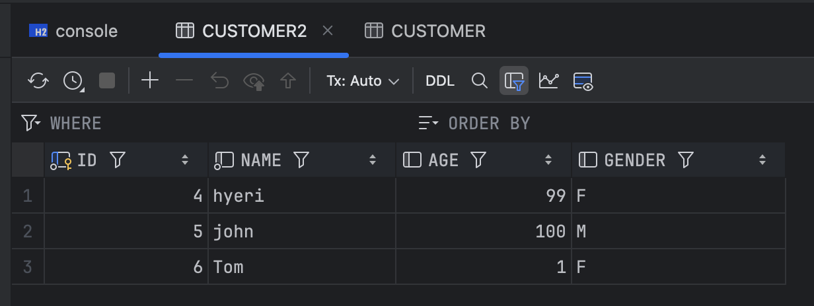

# JdbcPagingItemReader / JdbcItemWriter

## JdbcItemReader
- JdbcPagingItemReader 는 Spring Batch에서 제공하는 ItemReader 중 하나
- 대규모 처리 효율성: 메모리 사용량을 최소화하고, 커밋 간격을 설정해 대규모 데이터를 효율적으로 처리할 수 있음
- 쿼리 최적화: SQL을 직접 작성하여 최적화된 데이터 읽기가 가능
- 커서 제어: 데이터베이스 커서를 사용해 데이터 순회를 제어 가능

### 구성요소
- DataSource: 데이터베이스 연결 정보를 설정한다
- SqlQuery: 데이터를 읽을 SQL 쿼리 설정
- RowMapper: SQL 쿼리 결과를 Item으로 변환하는 역할
- PageSize: 페이지 크기 설정
- SkippableItemReader: 오류 발생 시 해당 Item을 건너뛸 수 있도록 함
- ReadListener: 읽기 시작, 종료, 오류 발생 등의 이벤트를 처리 할 수 있도록 함
- SaveStateCallBack: 잡 중단 시 현재 상태를 저장해 재시작 시 이어서 처리할 수 있도록 함


### 샘플 코드
#### customer 테이블 및 클래스 생성
```sql
create table customer (
    id      bigint auto_increment primary key,
    name    varchar(100)    not null,
    age     int          null,
    gender  varchar(5)      null
);

insert into customer (name, age, gender) values ('hyeri01', 99, 'F');
insert into customer (name, age, gender) values ('hyeri02', 98, 'M');
insert into customer (name, age, gender) values ('hyeri03', 97, 'F');
insert into customer (name, age, gender) values ('hyeri04', 96, 'M');
insert into customer (name, age, gender) values ('hyeri05', 1, 'F');
```

```kotlin
@Entity
class Customer(
    @Id
    @GeneratedValue(strategy = GenerationType.IDENTITY)
    val id: Long? = null,
    val name: String,
    val age: Int,
    val gender: String,
)
```

#### queryProvider 생성
실제 batch 에서 데이터를 읽어올 쿼리를 작성한다.
```kotlin
    @Bean
    fun queryProvider(): PagingQueryProvider {
        return SqlPagingQueryProviderFactoryBean().apply {
            setDataSource(dataSource)
            setSelectClause("id, name, age, gender")
            setFromClause("from customer")
            setWhereClause("where age >= :age")
            setSortKeys(mutableMapOf(
                Pair("id", Order.DESCENDING),
            ))
        }.getObject()
    }
```
- SqlPagingQueryProviderFactoryBean: 쿼리 프로파이더 팩토리
- setDataSource: 사용할 데이터 소스 설정
- setSelectClause: select 절 설정
- setFromClause: from 절 설정
- setWhereClause: where 절 설정
- setSortKeys: 정렬 설정

#### ItemReader 생성
```kotlin
@Bean
fun jdbcPagingItemReader(): JdbcPagingItemReader<Customer> {
    val parameterValue: MutableMap<String, Any> = HashMap()
    parameterValue["age"] = 20

    return JdbcPagingItemReaderBuilder<Customer>()
        .name("jdbcPagingItemReader")
        .fetchSize(chunkSize)
        .dataSource(dataSource)
        .rowMapper(BeanPropertyRowMapper(Customer::class.java))
        .queryProvider(queryProvider())
        .parameterValues(parameterValue)
        .build()
}
```
- BeanPropertyRowMapper: ResultSet의 각 row를 객체로 매핑함 (snakeCase > camelCase)
- parameterValues: sql에 매핑할 값 전달. 위의 예제에서는 where 절의 `:age`에 20을 매핑해 실행함

#### itemWriter
itemWriter는 지난 시간 사용했던 FlatFileItemWriter를 사용한다.
```kotlin
    @Bean
    fun customerFlatFileItemWriter(): FlatFileItemWriter<Customer> {
        return FlatFileItemWriterBuilder<Customer>()
            .name("customerFlatFileItemWriter")
            .resource(FileSystemResource("./output/customer_new_v1.csv"))
            .encoding("UTF-8")
            .delimited().delimiter("\t")
            .names("name", "age", "gender")
            .build()
    }
```

### 실행 결과
customer_new_v1.csv 파일에 다음과 같이 출력되었다.
```
hyeri04	96	M
hyeri03	97	F
hyeri02	98	M
hyeri01	99	F
```

<br />

## JdbcItemWriter
jdbc를 통해 데이터를 저장하는 데 사용되는 ItemWriter이며, Spring Batch에서 제공한다.

### 구성요소
- DataSource: 데이터베이스 연결 정보 설정
- SqlStatementCreator: INSERT 쿼리 생성 역할
- PreparedStatementSetter: INSERT 쿼리의 파라미터 값 설정
- ItemSqlParameterSourceProvider: Item 객체를 기반으로 PreparedStatementSetter에 전달할 파라미터 값을 생성하는 역할

### 샘플 코드
파일의 데이터를 읽어서 customer2 테이블에 저장하기
#### customer2 클래스 생성
```sql
create table customer2 (
    id      bigint auto_increment primary key,
    name    varchar(100)    not null,
    age     int          null,
    gender  varchar(5)      null
);
```

#### ItemReader
itemReader는 flatFileItemReader를 사용한다
```kotlin
    @Bean
    fun flatFileItemReader(): FlatFileItemReader<Customer> {
        return FlatFileItemReaderBuilder<Customer>()
            .name("FlatFileItemReader")
            .resource(ClassPathResource("./customer.csv"))
            .encoding(encoding)
            .delimited().delimiter(",")
            .names("name", "age", "gender")
            .targetType(Customer::class.java)
            .build()
    }
```

#### ItemSqlParameterSourceProvider
```kotlin
class CustomerItemSqlParameterSourceProvider : ItemSqlParameterSourceProvider<Customer> {
    override fun createSqlParameterSource(item: Customer): SqlParameterSource {
        return BeanPropertySqlParameterSource(item)
    }
}
```


#### ItemWriter
```kotlin
    @Bean
    fun jdbcItemWriter(): JdbcBatchItemWriter<Customer> {
        return JdbcBatchItemWriterBuilder<Customer>()
            .dataSource(dataSource)
            .sql("INSERT INTO customer2 (name, age, gender) VALUES (:name, :age, :gender)")
            .itemSqlParameterSourceProvider(CustomerItemSqlParameterSourceProvider())
            .build()
    }
```

#### 테스트
customer.csv 파일에 다음과 같은 파일을 만들고 실행해보면 \
Customer2 테이블에 데이터가 추가됨을 알 수 있다.

```
hyeri, 99, F
john, 100, M
Tom, 1, F
```


