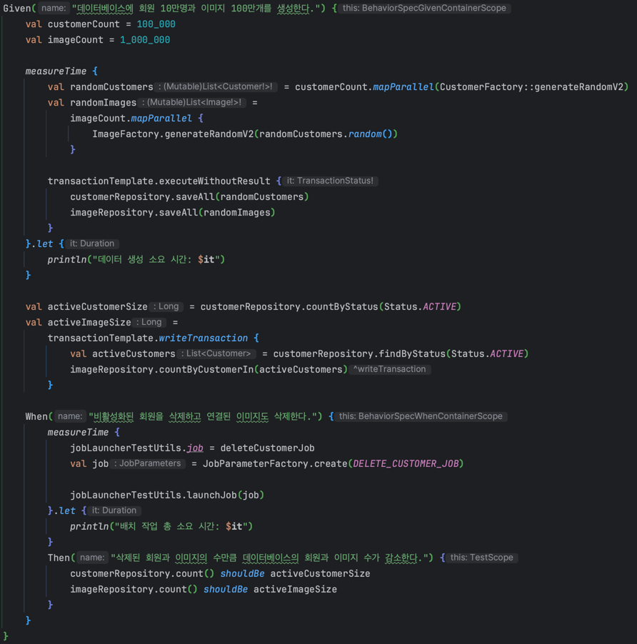
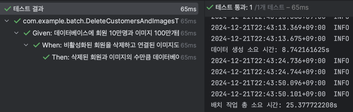

# MyBatisPagingItemReader로 DB내용을 읽고, MyBatisItemWriter로 DB에 쓰기

## MyBatisItemReader

MyBatis는 Object Relation Mapper를 이용한다.  
MyBatis 쿼리 매퍼를 커스텀해서 사용하기 때문에 설정이 간편하고 복잡한 동적 쿼리도 쉽게 처리할 수 있다.  
하지만 mybatis library에 의존해야하고 커스터마이징이 생각보다 어렵다.  
그리고 xml 파일을 사용하기 때문에 가독성이 떨어진다.  

- SqlSessionFactory: MyBatis 설정 정보 및 SQL 쿼리 매퍼 정보를 담고 있는 객체
- QueryId: 데이터를 읽을 MyBatis 쿼리 ID
- PageSize: 페이징 쿼리를 위한 페이지 크기를 지정
 
SqlSessionFactory는 MyBatisPagingItemReader의 SqlSessionFactory 객체를 통해 MyBatis와 연동한다.
Configuration 파일에서 @Bean으로 등록하거나 Spring Batch XML 설정 파일에서 설정 가능하다.

QueryId는 MyBatisPagingItemReader setQueryId() 메소드를 통해 데이터를 읽을 MyBatis 쿼리 ID를 설정한다.

MyBatisItemReader는 pageSize를 이용하여 offset, limit을 이용해서 페이징 처리를 하고 SkippableItemReader를 상속받아 예외 발생 시 처리할 수 있다.  

## MyBatisItemWriter

MyBatisItemWriter는 MyBatis를 이용하여 데이터를 쓰는 ItemWriter이다.  

- SqlSessionTemplate: MyBatis SqlSession 생성 및 관리를 위한 템플릿 객체
- SqlSessionFactory: SqlSessionTemplate 생성을 위한 팩토리 객체
- StatementId: 실행할 MyBatis SQL mapper의 상태 ID
- ItemToParameterConverter: 객체를 ParameterMap으로 변경

이전 챕터 미션에서 회원 10만 명과 이미지 100만개를 생성하고, 회원이 삭제될 때 이미지도 삭제되는 배치를 만들었다.  
아래 이미지는 결과이다.

